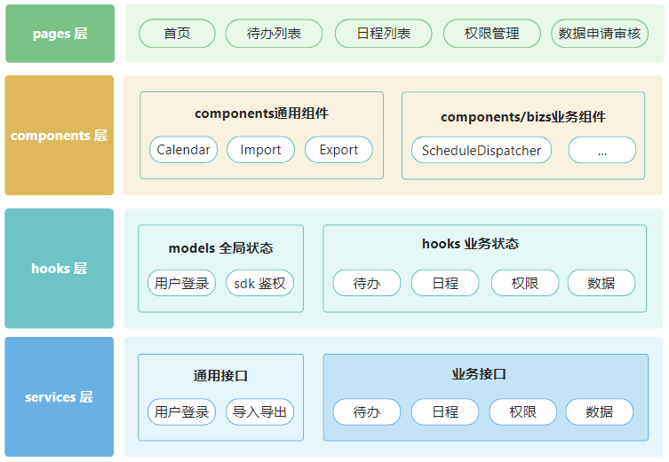
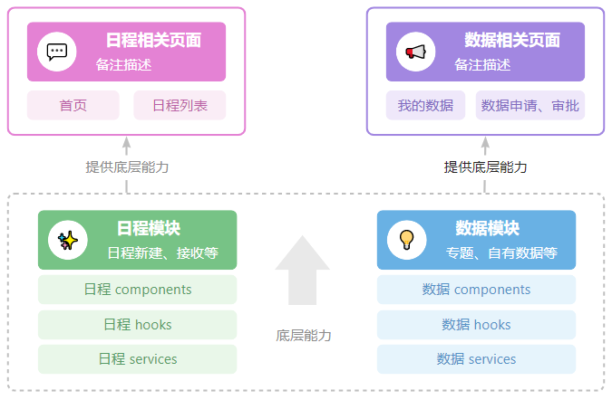

---
nav:
  title: 手册指南
  order: 2
title: 应用结构
order: 1
group:
  title: 应用开发参考手册
  order: 2
---

## 应用结构

应用结构主要有两种模式：

- 水平分层模式：services、hooks、components、pages 独立分层。在这种模式下，可借助 services 层生成工具生成 types 以及 services；借助页面生成器生成页面；
- 垂直分层模式：通过业务模块成捆组织 services、hooks、components。在这种模式下，可借助页面生成器生成页面及相关 services；

整个应用尽量向一种分层模型靠拢。若应用采用其他模型，需给出文档解释。

### 水平分层

以一体化工作台为例：

补充说明：

1. 从 services 到 components 层，均分为通用（或全局）和业务专用两部分；
   a. 通用指的是不限于单个业务模块专用的接口、状态及组件，包含用户登录信息、附件上传下载、excel 导入导出等。在这一部分，需要关注在一个长期迭代的项目中，后端提供的附件上传、excel 导入导出等接口是否是通用的，比如防疫系统早期，excel 导入导出的实现均不是通用的，随着业务的发展，后端又提供了通用的接口，这无疑会影响前端的组件抽象和代码组织；直到防疫系统下线后，新旧两版的导入导出方式依然存在。所以，对一个长期项目，前端可以协助后端，提前预判部分接口是不是可以实现成通用接口，通用携带业务标识的方式给某些业务功能使用；
   b. 专用指的是仅限于特定业务模块使用的接口、状态及组件，比如防疫系统中的重点人员模块相关接口、一体化工作台中的日程模块相关接口等；
2. 全局状态可以抽象成一个 umijs 中的 model，无需借助 React.createContext。需要注意的是，umijs 的 model 没法按需加载，因此，业务专用的状态不适合抽象成 model。如果业务专用的状态需要跨组件共享（局部跨组件状态），可借助 unstated-next；
   a. 落盘在 model 及 hooks 层的钩子，理想情况下，这些钩子可包含接口调用、数据转换、较为通用的视图状态等，与特定的视图状态无关，以便于复用。仅限于单个视图组件专用的状态，可在视图组件内部或其临近的 hook 中组织其状态管理逻辑；
3. 通用组件及业务组件可通过 components 再分层加以区分，比如新建 components-bizs 分层或 components/bizs 子分层等形式；
   a. 通用组件包含：
   ⅰ. 可跨业务共享的组件，比如 Calendaer，这一部分有条件乔迁到通用组件库中；
   ⅱ. 消费了全局状态的组件，比如浙政钉选人组件 UserSelect（消费了 jsbridge 鉴权）；
   b. 业务组件仅限于业务相关视图使用，比如新增日程弹窗组件 ScheduleDispatcher 既会在首页中使用，又会在日程列表中使用。较不理想的业务组件比如由 pages 层产出该业务组件给到其他页面组件使用，或者消费了不知从哪里传递的上下文数据。理想的业务组件，是与上下文无关的（全局状态除外）。如需消费，可通过 console.warn 提示使用 Provider 包裹的情况；
4. pages 页面组件可组织仅与当前页面相关的组件、hook；

优缺点

- 【优点】该模型与后端的 mapper、service、controller 分层贴合。但是，与 java 工程不同，
  - java 工程仅有通过 localThread 传递的全局状态，前端不只有全局状态，还有局部跨组件状态（这在补充说明 3-b 中已有说明）；
  - java 工程中的 services 可复用程度较高，前端的 hooks 可能耦合了特定的视图状态，仅被与某一个视图部件所使用（这在补充说明 2-a 中已有说明）；
- 【优点】pc、h5 跨端复用性上，services、理想的 hooks 均可水平迁移；
- 【优点即缺点】以视图层为思考切入点，对可复用组件、接口及状态缺少综合把控，会造成重复开发。不可复用也意味着解耦，对设计统筹、团队协作的要求较少；
- 【优点】团队内部认可度高，无需额外的培训成本；
- 【缺点】主要是使用层面的，在缺乏设计统筹的情况下，会出现以下几种可能的情况：
  - 同一个接口在多个 service 中反复定义，比如原打分工具获取全量指标树接口就在多个 service 中反复定义；
  - 视图组件直接调 services 层接口，后端丢过来的数据转换成前端所需的数据这种数据转换逻辑也会在多个视图组件中反复出现；
  - hooks 层中的钩子与特定的视图状态绑定，导致其可复用性较低；
  - pages 层直接导出组件给其他页面使用，比如原打分工具指标审核页面的组件来自于指标录入页面，这就需要一个 components/bizs 去存放可在多个视图组件中复用的组件；

### 垂直分层

以一体化工作台为例：

补充说明：

1. 通用或全局接口、状态、组件仍旧采用水平分层的方式加以组织；其他业务专用的接口、状态、组件则采用更内聚的方式加以组织；
2. 视图层单一的业务模块，比如权限管理，可以在 pages 层中组织其所使用的 hooks 及 services，这些 services 仅在当前视图中使用。视图层较为繁复的业务模块，比如上图中的日程、数据模块，它们不只被一个页面所使用，可以在 entities 层中组织从 types、services、hooks、components，导出组件及钩子等被不同页面使用；

#### 优缺点

- 【优点】该模型与后端的逻辑结构贴合。比如一体化工作台中，首页及日程列表页均会有日程相关视图，后端编码中，这两部分的视图数据均来自于 ScheduleController。又比如一体化工作台中，共享数据包含专题数据、自有数据、省市回流数据三种，它们会在数据资源目录、我的申请、我的审批、我的数据、我的自有数据、数据详情等几个页面中有所体现，后端的表是同一份；
- 【优点即缺点】以可复用性为思考切入点，可推动开发者对可复用组件、接口及状态作综合把控。复用也意味着耦合，对设计统筹、团队协作有额外要求；
- 【优点】pc、h5 跨端复用性上，entities 迁移时需要剔除 components；
- 【缺点】团队内部认可度低，需要额外的培训成本；
