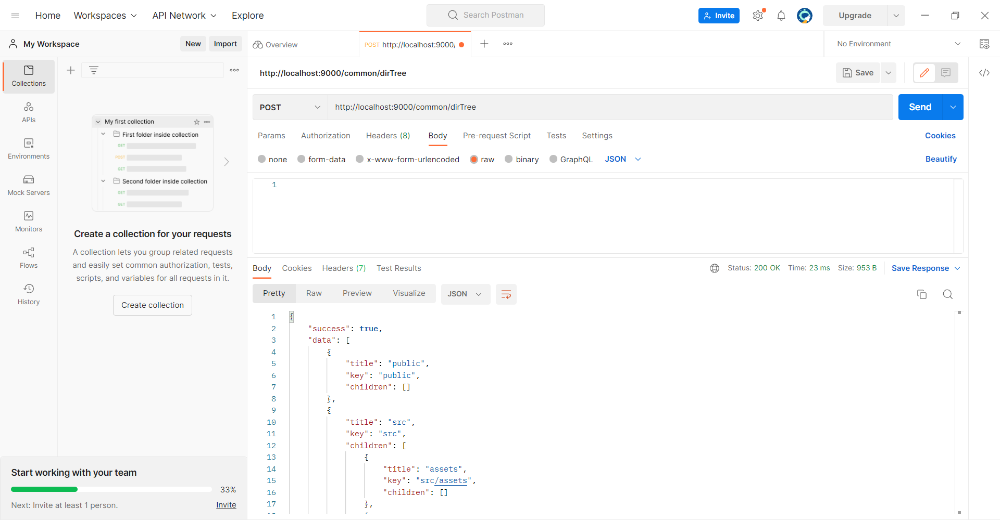
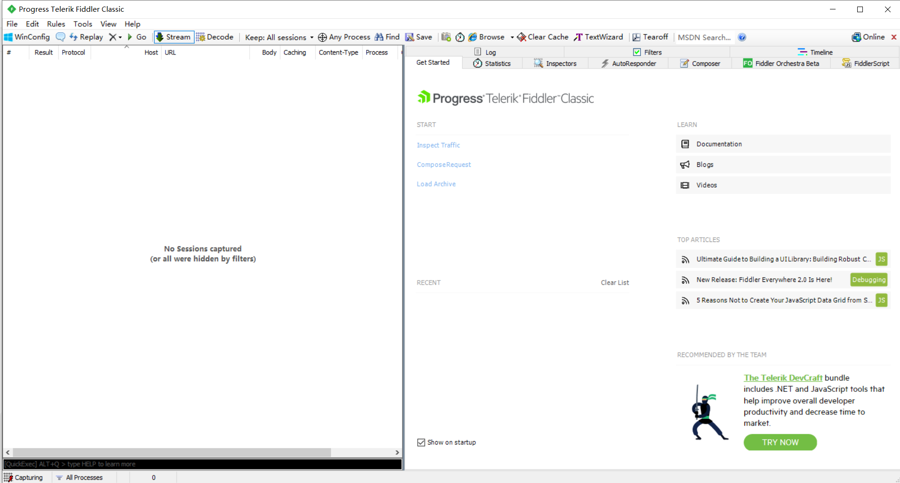
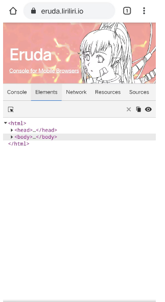

---
nav:
  title: 手册指南
  order: 2
title: 第一天：环境准备
order: 2
group:
  title: 新人手册
  order: 1
---

## 第一天：环境准备

### step1 连接公网 szzj

```yaml | pure
用户名：szzj
密码：sj20200927
```

### step2 申请政务外网（日常开发使用）

钉钉流程：https://twbmtk.aliwork.com/APP_Z8U594UPXIO7GXB4XB7C/workbench?spm=a2q5o.26736374.0.0.2b0a11dcouUCCV

```yaml | pure
用户名：zwww
密码：Sj20200927!@
```

### step3 安装 node.js

推荐使用 [nvm](https://github.com/nvm-sh/nvm) 管理 node.js 版本。当然，您也可以至 [node.js 官网](https://nodejs.org/en)下载最新稳定版本。鉴于部分历史项目使用 node-sass，该库需要与 node.js 版本契合，node.js 最新稳定版本可能会导致依赖安装时的异常。

#### 安装 nvm

- windows 环境：请下载 [nvm-windows](http://github.com/corebutler/nvm-windows/releases) 并安装；
- mac 环境：执行 curl -o- https://raw.githubusercontent.com/nvm-sh/nvm/v0.38.0/install.sh | bash 命令，安装 nvm；

安装完成后，执行 nvm -v 命令检查 nvm 是否安装成功。

#### 使用 nvm 管理 node.js 版本

```bash
# 安装 16.18.0 版本
nvm install 16.18.0

# 切换使用 16.18.0 版本
nvm use 16.18.0

# 查看所有已安装的 node.js 版本
nvm list
```

### step4 安装包管理器

推荐的包管理器有：

- [cnpm](https://npmmirror.com/): 使用 npm install -g cnpm --registry=https://registry.npmmirror.com 命令安装；
- [yarn](https://www.yarnpkg.cn/): 使用 cnpm i -g corepack; corepack prepare yarn@stable --activate 命令安装；
- [pnpm](https://pnpm.io/)：使用 npm install -g pnpm 安装；

使用包管理器时，需要将 registry 源切换到 cnpm 私仓地址 http://10.145.11.76:30090/。推荐使用 nrm 管理 registry 源。当然，您也可以使用 cnpm config set registry http://10.145.11.76:30090/ 或 yarn config set registry http://10.145.11.76:30090/ 等命令切换 registry 源。

#### 使用 nrm 管理 registry 源

```bash
# 全局安装 nrm
cnpm install -g nrm

# 将 cnpm 私有仓库添加进去
nrm add szzj http://10.145.11.76:30090/

# 切换到私仓 szzj 源
nrm use szzj
```

### step5 安装编辑器

您可以使用 [Visual Studio Code 编辑器](https://code.visualstudio.com/)进行开发。安装完成后，请在首选项中搜索 eol，将其设置为 lf，以统一换行符。

以下是 VsCode 编辑器的必备扩展：

- prettier: 代码美化；
- eslint: javascript 编码风格检查；
- stylelint: css 样式编码风格检查；
- CSScomb：css 属性名排序；
- GitLens：

#### prettier 代码美化

1. 安装 Prettier 扩展；
2. 首选项追加如下配置：

```json | pure
{
 "editor.formatOnSave": true,
 "editor.defaultFormatter": "esbenp.prettier-vscode"
}
```

#### eslint 代码检查

1. 安装 eslint 扩展；
2. 首选项追加如下配置：

```json | pure
{
  "editor.codeActionsOnSave": {
    "source.fixAll.eslint": true
  }
}
```

需要在工程中配置 .eslintrc.js 如【注意：模板工程会自带】：

```js | pure
module.exports = {
  parser: '@typescript-eslint/parser',
  /**
   * - umi/eslint: 扩展自umi4推荐的eslint
   * - plugin:prettier/recommended：
   *
   * - 注意：对eslint的规则改动，在.eslintrc.js，prettier规则改动在.prettierrc，规则改动可能不及时生效，重启vscode即可
   */
  extends: [
    // umi/eslint: 扩展自umi4推荐的eslint
    require.resolve('umi/eslint'),
    /**
     * 让eslint继承prettier配置&防止规则冲突，这样再结合vscode的插件能力，就可以autofix了。
     * 主要是降低使用成本，做到保存即格式化，又能遵循“eslint负责代码质量，prettier负责代码格式美化”
     * - 参考：https://github.com/prettier/eslint-plugin-prettier
     */
    'plugin:prettier/recommended',
    /**react jsx的规则 */
    'plugin:react/recommended',
    /**react17使用jsx-runtime无需手动导入React */
    'plugin:react/jsx-runtime',
    /**ts的规则 */
    'plugin:@typescript-eslint/recommended',
  ],
  rules: {
    '@typescript-eslint/ban-ts-comment': 1, //在这里对基础配置做一些修改，及增加格外规则
  },
};
```

#### Stylelint

需要在工程中配置 .stylelintrc.js 如：

```js | pure
module.exports = {
  extends: [require.resolve('umi/stylelint'), 'stylelint-config-rational-order'],
  plugins: ['stylelint-order'],
  rules: {
    /**不允许空代码块**/
    'block-no-empty': null,
  },
};
```

#### CSScomb

1. 安装 CSScomb 扩展；
2. 首选项追加如下配置（更多可参考 https://github.com/csscomb/csscomb.js/blob/dev/doc/options.md）：

```json | pure
{
  "csscomb.formatOnSave": true,
  "csscomb.preset": {
    "always-semicolon": true, //结尾分号
    "color-case": "lower", //颜色小写
    "block-indent": 2, //缩进
    "color-shorthand": true, //颜色简写
    "element-case": "lower", //选择器小写
    "eof-newline": true, //
    "leading-zero": true, //保留小数点前的0
    "quotes": "double", //双引号
    "space-before-colon": 1, //冒号前空格
    "space-after-colon": "", //冒号后无空格
    "space-before-combinator": " ", //在组合器之前设置空格
    "space-after-combinator": " ", //在组合器之后设置空格
    "space-between-declarations": "\n", //换行
    "space-before-opening-brace": " ", // .{之前设置空格
    "space-after-opening-brace": "\n", //.{之前设置换行
    "space-after-selector-delimiter": " ", //选择器前设置空格
    "space-before-selector-delimiter": "", //选择气候无空格
    "space-before-closing-brace": "\n", //尾括号换行
    "tab-size": true, //制表符
    "sort-order": [
      [
        "position",
        "top",
        "right",
        "bottom",
        "left",
        "z-index",
        "display",
        "visibility",
        "float",
        "clear",
        "overflow",
        "-ms-overflow-x",
        "-ms-overflow-y",
        "overflow-x",
        "overflow-y",
        "-webkit-overflow-scrolling",
        "clip",
        "-webkit-align-content",
        "-ms-flex-line-pack",
        "align-content",
        "-webkit-box-align",
        "-moz-box-align",
        "-webkit-align-items",
        "align-items",
        "-ms-flex-align",
        "-webkit-align-self",
        "-ms-flex-item-align",
        "-ms-grid-row-align",
        "align-self",
        "-webkit-box-flex",
        "-webkit-flex",
        "-moz-box-flex",
        "-ms-flex",
        "flex",
        "-webkit-flex-flow",
        "-ms-flex-flow",
        "flex-flow",
        "-webkit-flex-basis",
        "-ms-flex-preferred-size",
        "flex-basis",
        "-webkit-box-orient",
        "-webkit-box-direction",
        "-webkit-flex-direction",
        "-moz-box-orient",
        "-moz-box-direction",
        "-ms-flex-direction",
        "flex-direction",
        "-webkit-flex-grow",
        "-ms-flex-positive",
        "flex-grow",
        "-webkit-flex-shrink",
        "-ms-flex-negative",
        "flex-shrink",
        "-webkit-flex-wrap",
        "-ms-flex-wrap",
        "flex-wrap",
        "-webkit-box-pack",
        "-moz-box-pack",
        "-ms-flex-pack",
        "-webkit-justify-content",
        "justify-content",
        "-webkit-box-ordinal-group",
        "-webkit-order",
        "-moz-box-ordinal-group",
        "-ms-flex-order",
        "order",
        "-webkit-box-sizing",
        "-moz-box-sizing",
        "box-sizing",
        "margin",
        "margin-top",
        "margin-right",
        "margin-bottom",
        "margin-left",
        "padding",
        "padding-top",
        "padding-right",
        "padding-bottom",
        "padding-left",
        "min-width",
        "min-height",
        "max-width",
        "max-height",
        "width",
        "height",
        "outline",
        "outline-width",
        "outline-style",
        "outline-color",
        "outline-offset",
        "border",
        "border-spacing",
        "border-collapse",
        "border-width",
        "border-style",
        "border-color",
        "border-top",
        "border-top-width",
        "border-top-style",
        "border-top-color",
        "border-right",
        "border-right-width",
        "border-right-style",
        "border-right-color",
        "border-bottom",
        "border-bottom-width",
        "border-bottom-style",
        "border-bottom-color",
        "border-left",
        "border-left-width",
        "border-left-style",
        "border-left-color",
        "-webkit-border-radius",
        "-moz-border-radius",
        "border-radius",
        "-webkit-border-top-left-radius",
        "-moz-border-radius-topleft",
        "border-top-left-radius",
        "-webkit-border-top-right-radius",
        "-moz-border-radius-topright",
        "border-top-right-radius",
        "-webkit-border-bottom-right-radius",
        "-moz-border-radius-bottomright",
        "border-bottom-right-radius",
        "-webkit-border-bottom-left-radius",
        "-moz-border-radius-bottomleft",
        "border-bottom-left-radius",
        "-webkit-border-image",
        "-moz-border-image",
        "-o-border-image",
        "border-image",
        "-webkit-border-image-source",
        "-moz-border-image-source",
        "-o-border-image-source",
        "border-image-source",
        "-webkit-border-image-slice",
        "-moz-border-image-slice",
        "-o-border-image-slice",
        "border-image-slice",
        "-webkit-border-image-width",
        "-moz-border-image-width",
        "-o-border-image-width",
        "border-image-width",
        "-webkit-border-image-outset",
        "-moz-border-image-outset",
        "-o-border-image-outset",
        "border-image-outset",
        "-webkit-border-image-repeat",
        "-moz-border-image-repeat",
        "-o-border-image-repeat",
        "border-image-repeat",
        "-webkit-border-top-image",
        "-moz-border-top-image",
        "-o-border-top-image",
        "border-top-image",
        "-webkit-border-right-image",
        "-moz-border-right-image",
        "-o-border-right-image",
        "border-right-image",
        "-webkit-border-bottom-image",
        "-moz-border-bottom-image",
        "-o-border-bottom-image",
        "border-bottom-image",
        "-webkit-border-left-image",
        "-moz-border-left-image",
        "-o-border-left-image",
        "border-left-image",
        "-webkit-border-corner-image",
        "-moz-border-corner-image",
        "-o-border-corner-image",
        "border-corner-image",
        "-webkit-border-top-left-image",
        "-moz-border-top-left-image",
        "-o-border-top-left-image",
        "border-top-left-image",
        "-webkit-border-top-right-image",
        "-moz-border-top-right-image",
        "-o-border-top-right-image",
        "border-top-right-image",
        "-webkit-border-bottom-right-image",
        "-moz-border-bottom-right-image",
        "-o-border-bottom-right-image",
        "border-bottom-right-image",
        "-webkit-border-bottom-left-image",
        "-moz-border-bottom-left-image",
        "-o-border-bottom-left-image",
        "border-bottom-left-image",
        "background",
        "filter:progid:DXImageTransform.Microsoft.AlphaImageLoader",
        "background-color",
        "background-image",
        "background-attachment",
        "background-position",
        "-ms-background-position-x",
        "-ms-background-position-y",
        "background-position-x",
        "background-position-y",
        "-webkit-background-clip",
        "-moz-background-clip",
        "background-clip",
        "background-origin",
        "-webkit-background-size",
        "-moz-background-size",
        "-o-background-size",
        "background-size",
        "background-repeat",
        "box-decoration-break",
        "-webkit-box-shadow",
        "-moz-box-shadow",
        "box-shadow",
        "color",
        "table-layout",
        "caption-side",
        "empty-cells",
        "list-style",
        "list-style-position",
        "list-style-type",
        "list-style-image",
        "quotes",
        "content",
        "counter-increment",
        "counter-reset",
        "-ms-writing-mode",
        "vertical-align",
        "text-align",
        "-webkit-text-align-last",
        "-moz-text-align-last",
        "-ms-text-align-last",
        "text-align-last",
        "text-decoration",
        "text-emphasis",
        "text-emphasis-position",
        "text-emphasis-style",
        "text-emphasis-color",
        "text-indent",
        "-ms-text-justify",
        "text-justify",
        "text-outline",
        "text-transform",
        "text-wrap",
        "-ms-text-overflow",
        "text-overflow",
        "text-overflow-ellipsis",
        "text-overflow-mode",
        "text-shadow",
        "white-space",
        "word-spacing",
        "-ms-word-wrap",
        "word-wrap",
        "-ms-word-break",
        "word-break",
        "-moz-tab-size",
        "-o-tab-size",
        "tab-size",
        "-webkit-hyphens",
        "-moz-hyphens",
        "hyphens",
        "letter-spacing",
        "font",
        "font-weight",
        "font-style",
        "font-variant",
        "font-size-adjust",
        "font-stretch",
        "font-size",
        "font-family",
        "src",
        "line-height",
        "opacity",
        "-ms-filter:\\'progid:DXImageTransform.Microsoft.Alpha",
        "filter:progid:DXImageTransform.Microsoft.Alpha(Opacity",
        "-ms-interpolation-mode",
        "-webkit-filter",
        "-ms-filter",
        "filter",
        "resize",
        "cursor",
        "nav-index",
        "nav-up",
        "nav-right",
        "nav-down",
        "nav-left",
        "-webkit-transition",
        "-moz-transition",
        "-ms-transition",
        "-o-transition",
        "transition",
        "-webkit-transition-delay",
        "-moz-transition-delay",
        "-ms-transition-delay",
        "-o-transition-delay",
        "transition-delay",
        "-webkit-transition-timing-function",
        "-moz-transition-timing-function",
        "-ms-transition-timing-function",
        "-o-transition-timing-function",
        "transition-timing-function",
        "-webkit-transition-duration",
        "-moz-transition-duration",
        "-ms-transition-duration",
        "-o-transition-duration",
        "transition-duration",
        "-webkit-transition-property",
        "-moz-transition-property",
        "-ms-transition-property",
        "-o-transition-property",
        "transition-property",
        "-webkit-transform",
        "-moz-transform",
        "-ms-transform",
        "-o-transform",
        "transform",
        "-webkit-transform-origin",
        "-moz-transform-origin",
        "-ms-transform-origin",
        "-o-transform-origin",
        "transform-origin",
        "-webkit-animation",
        "-moz-animation",
        "-ms-animation",
        "-o-animation",
        "animation",
        "-webkit-animation-name",
        "-moz-animation-name",
        "-ms-animation-name",
        "-o-animation-name",
        "animation-name",
        "-webkit-animation-duration",
        "-moz-animation-duration",
        "-ms-animation-duration",
        "-o-animation-duration",
        "animation-duration",
        "-webkit-animation-play-state",
        "-moz-animation-play-state",
        "-ms-animation-play-state",
        "-o-animation-play-state",
        "animation-play-state",
        "-webkit-animation-timing-function",
        "-moz-animation-timing-function",
        "-ms-animation-timing-function",
        "-o-animation-timing-function",
        "animation-timing-function",
        "-webkit-animation-delay",
        "-moz-animation-delay",
        "-ms-animation-delay",
        "-o-animation-delay",
        "animation-delay",
        "-webkit-animation-iteration-count",
        "-moz-animation-iteration-count",
        "-ms-animation-iteration-count",
        "-o-animation-iteration-count",
        "animation-iteration-count",
        "-webkit-animation-direction",
        "-moz-animation-direction",
        "-ms-animation-direction",
        "-o-animation-direction",
        "animation-direction",
        "pointer-events",
        "unicode-bidi",
        "direction",
        "-webkit-columns",
        "-moz-columns",
        "columns",
        "-webkit-column-span",
        "-moz-column-span",
        "column-span",
        "-webkit-column-width",
        "-moz-column-width",
        "column-width",
        "-webkit-column-count",
        "-moz-column-count",
        "column-count",
        "-webkit-column-fill",
        "-moz-column-fill",
        "column-fill",
        "-webkit-column-gap",
        "-moz-column-gap",
        "column-gap",
        "-webkit-column-rule",
        "-moz-column-rule",
        "column-rule",
        "-webkit-column-rule-width",
        "-moz-column-rule-width",
        "column-rule-width",
        "-webkit-column-rule-style",
        "-moz-column-rule-style",
        "column-rule-style",
        "-webkit-column-rule-color",
        "-moz-column-rule-color",
        "column-rule-color",
        "break-before",
        "break-inside",
        "break-after",
        "page-break-before",
        "page-break-inside",
        "page-break-after",
        "orphans",
        "widows",
        "-ms-zoom",
        "zoom",
        "max-zoom",
        "min-zoom",
        "user-zoom",
        "orientation"
      ]
    ]
  }
}
```

### step6 调试工具

以下是可供参考的调试抓包工具：

- Postman: 接口调试与测试；
- Fiddler: 抓包工具；
- Eruda:移动端调试面板；

#### Postman



#### Fiddler



#### Eruda


