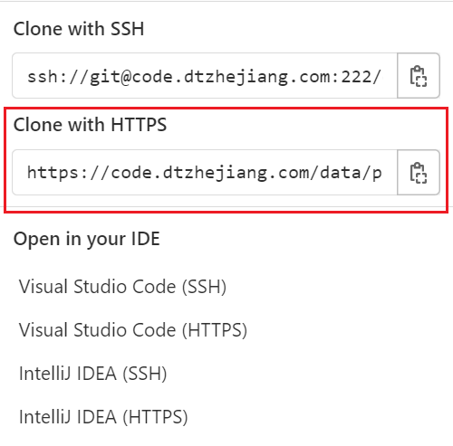
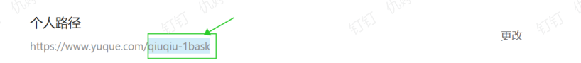

---
nav:
  title: 手册指南
  order: 2
title: 第二天：账户权限
order: 3
group:
  title: 新人手册
  order: 1
---

## 第二天：账户权限

### step1 gitlab 仓库

我们使用 gitlab 管理源代码，您可以通过 [Pro Git](https://git-scm.com/book/zh/v2) 了解并熟悉 git 操作。

正式同学请使用 @dtzhejiang.com 邮箱申请 gitlab 账号，合作伙伴同学不作限制。申请后须找 @李要辉 进行审批。审批通过后，您就可以通过 https://code.dtzhejiang.com/ 访问 gitlab 仓库了。

gitlab 工程分为业务类项目与基建类项目两类，两者均按需开放。如果缺失项目的访问权限，可以找组长或者副组长进行添加。

等到项目权限开通之后，就可以通过 git clone 命令拷贝工程，并在本地环境中启动调试了【备注：SSH 无效，使用后者】。

### step2 浙政钉账户（按需）

姓名+手机号+所做项目，发给柯南申请。

### step3 figma、jenkins、禅道

|               |    功用    |                                  链接 |              如何申请 |
| :------------ | :--------: | ------------------------------------: | --------------------: |
| figma（按需） | 页面设计稿 |                 https://www.figma.com | 按项目由 ued 分配权限 |
| jenkins       |  发布平台  |                  http://10.145.11.76/ |                吴立勋 |
| 禅道          |  测试平台  | https://zentao.dtzhejiang.com/pro/my/ |                穆梦思 |

### step4 语雀

我们使用[语雀](https://dtzhejiang.yuque.com/fmki7n/xex2vc)维护项目及技术文档。

对于未开通语雀权限的同学，可由该同学直接项目主管作为负责人向@球球申请权限，同时提供同学姓名、语雀用户名。此外，负责人须在该同学离场后第一时间同步球球删除知识库权限。附：语雀用户名查询方法 https://www.yuque.com/settings/account （审批人：球球）。

### step5 快速上手

当您有了相关权限之后，就可以 clone 项目并了解相关需求及技术文档了。凭着您的聪明才智，快速上手自不在话下哦~
