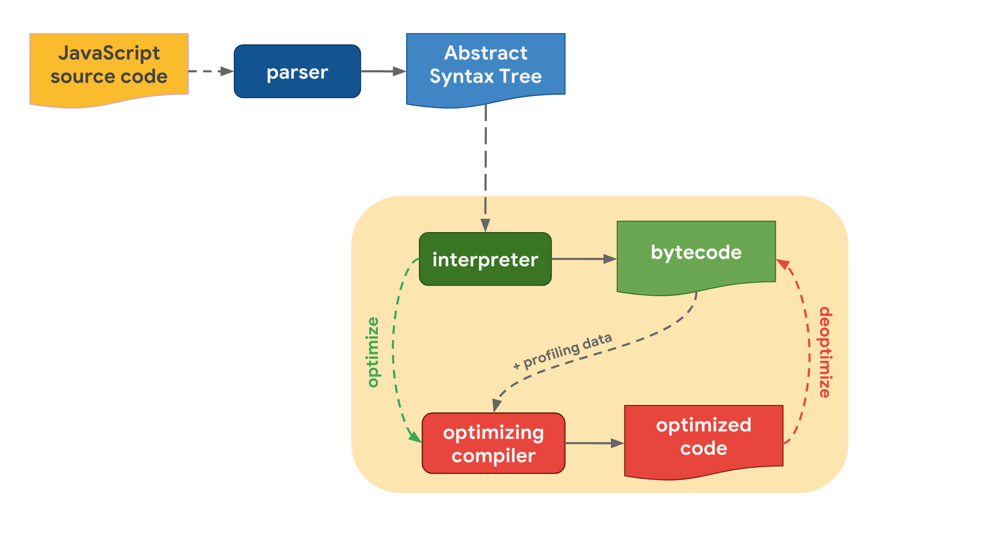

# how javascript works

## js 引擎

js 引擎运作机制分为AST分析、引擎执行两个步骤  

JS 源码通过 parser（分析器）转化为 AST（抽象语法树），再经过 interpreter（解释器/点火器）解析为 bytecode（字节码）  
为了提高运行效率，optimizing compiler（优化编辑器/涡轮风扇发动机）负责生成 optimized code（优化后的机器码）  

## 执行上下文

执行上下文分全局执行上下文、函数执行上下文和 eval 函数执行上下文  
js 引擎首次读取 js 脚本，创建一个全局执行上下文并将其推入执行栈，函数每调用一次，js 引擎都会创建一个新的执行上下文并推入到执行栈  
引擎运行执行上下文在执行栈顶端的函数，通过 return 将栈顶函数弹出，上下文的控制全将转移到新的栈顶的执行上下文  
执行上下文分为创建和执行两个阶段  
创建阶段确定 this 指向，创建词法环境和变量环境

```js
let a = 20;
const b = 30;
var c;

function multiply(e, f) {
 var g = 20;
 return e * f * g;
}
c = multiply(20, 30);

// 伪代码
GlobalExectionContext = {

  ThisBinding: <Global Object>,

  LexicalEnvironment: {  // 词法环境绑定 let const, 词法环境是 [标识符: 变量] 映射的结构
    EnvironmentRecord: {
      // 环境记录分为对象环境记录和声明性环境记录
      Type: "Object",
      // 标识符绑定在这里
      a: < uninitialized >,
      b: < uninitialized >,
      multiply: < func >
    }
    outer: <null>
  },

  VariableEnvironment: { // 变量环境绑定 var, 变量环境也是一个词法环境
    EnvironmentRecord: {
      Type: "Object",
      // 标识符绑定在这里
      c: undefined,
    }
    outer: <null>
  }
}

FunctionExectionContext = {

  ThisBinding: <Global Object>,

  LexicalEnvironment: {
    EnvironmentRecord: {
      Type: "Declarative",
      // 标识符绑定在这里
      Arguments: {0: 20, 1: 30, length: 2},
    },
    outer: <GlobalLexicalEnvironment>
  },

  VariableEnvironment: {
    EnvironmentRecord: {
      Type: "Declarative",
      // 标识符绑定在这里
      g: undefined
    },
    outer: <GlobalLexicalEnvironment>
  }
}

```

## 内存垃圾回收

- 垃圾回收引用计数：引用数为 0 则回收  
  优点：简单  
  缺点：循环引用不能回收
- 标记清除：标记内存中存储的所有变量，将所有在上下文中的变量和被上下文中的变量引用的变量去掉标记，剩余标记的变量就是待清除的  
  优点：解决循环引用

## 事件循环

事件循环的工作就是监测调用栈和回调队列，如果调用栈为空，就会从回调队列取得第一个事件入栈  
setTimeout(...) 创建了一个定时器，当定时器过期，宿主环境会把回调函数添加到事件循环队列中。

js运行时碰到await，会记录在哪里暂停执行，等到await 右侧的值可用，js运行时会向消息队列推送一个任务恢复异步执行  

```js
// 表示1秒后将callback添加到事件回调队列，如果回调队列不为空，回调就会被阻塞
setTimeout(callback, 1000);
// 表示延迟执行直到调用栈被清空
setTimeout(callback, 0);
```

async/await 对比 promise 的 4 种优势场景

```js
// 1. 简洁
rp("https://api.example.com/endpoint1").then(function (data) {
  // …
});
var response = await rp("https://api.example.com/endpoint1");

// 2. 错误处理：async/await 允许使用日常的 try/catch 代码结构体来处理同步和异步错误
function loadData() {
  try {
    // 捕获同步错误.
    getJSON()
      .then(function (response) {
        var parsed = JSON.parse(response);
        console.log(parsed);
      })
      .catch(function (e) {
        // 捕获异步错误.
        console.log(e);
      });
  } catch (e) {
    console.log(e);
  }
}
async function loadData() {
  try {
    var data = JSON.parse(await getJSON());
    console.log(data);
  } catch (e) {
    // 处理同步和异步错误
    console.log(e);
  }
}

// 3. 条件语句/多个promise连续执行 更直观
function loadData() {
  return getJSON().then(function (response) {
    if (response.needsAnotherRequest) {
      return makeAnotherRequest(response).then(function (anotherResponse) {
        console.log(anotherResponse);
        return anotherResponse;
      });
    } else {
      console.log(response);
      return response;
    }
  });
}
async function loadData() {
  var response = await getJSON();
  if (response.needsAnotherRequest) {
    var anotherResponse = await makeAnotherRequest(response);
    console.log(anotherResponse);
    return anotherResponse;
  } else {
    console.log(response);
    return response;
  }
}

// 4. promise.then 无法调试，也无法得知错误位置
function loadData() {
  return callAPromise()
    .then(callback1)
    .then(callback2)
    .then(callback3)
    .then(() => {
      throw new Error("boom");
    });
}
loadData().catch(function (e) {
  console.log(err);
  // Error: boom at callAPromise.then.then.then.then (index.js:8:13)
});
async function loadData() {
  await callAPromise1();
  await callAPromise2();
  await callAPromise3();
  await callAPromise4();
  await callAPromise5();
  throw new Error("boom");
}
loadData().catch(function (e) {
  console.log(err);
  // output
  // Error: boom at loadData (index.js:7:9)
});
```

``` js
// 高阶函数的范式，在此基础上更改函数的 执行前、执行中、执行后 三个阶段
function HOF0(fn) {
  return function(...args) {
    return fn.apply(this, args);
  }
}
```

尾递归优化的原理是使用尾调用优化（Tail Call Optimization），即在尾递归调用之前，将当前函数的栈帧（包括局部变量和参数）替换为新的栈帧，从而复用当前栈帧，避免了不必要的栈空间消耗。这样可以使得递归调用的深度不再增加，从而避免了堆栈溢出的问题。
所谓尾调用，就是函数的返回值是另一个函数的直接返回值
```js
// bad
function factorial(n) {
  if (n < 2) {
    return 1;
  }
  return n * factorial(n - 1); // <-- 不是尾调用
}
// good
function factorial(n, result = 1) {
  if (n < 2) {
    return result;
  }
  return factorial(n - 1, n * result); // <-- 尾调用
} 
```
