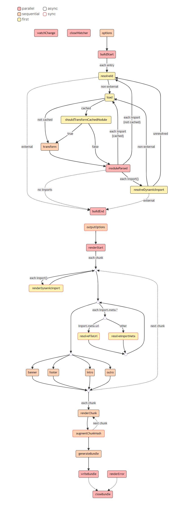

# rollup

## 常用配置解读

```ts
const buildOptions = {
  // 多入口配置
  input: ["src/index.js"],
  // 多产物配置
  output: [
    {
      // 产物输出目录
      dir: "dist/es",
      // 产物格式
      format: "esm",
    },
    {
      dir: 'dist/cjs',
      format: 'cjs'
    }
  ]
};

export default buildOptions;
```

不同配置的多入口配置
```ts
const buildIndexOptions = {
  input: ["src/index.js"],
  output: [
    // 省略 output 配置
  ],
};
const buildUtilOptions = {
  input: ["src/util.js"],
  output: [
    // 省略 output 配置
  ],
};

export default [buildIndexOptions, buildUtilOptions];
```

自定义output配置
```ts
{
  output: {
    // 产物输出目录
    dir: path.resolve(__dirname, 'dist'),
    // 以下三个配置项都可以使用这些占位符:
    // 1. [name]: 去除文件后缀后的文件名
    // 2. [hash]: 根据文件名和文件内容生成的 hash 值
    // 3. [format]: 产物模块格式，如 es、cjs
    // 4. [extname]: 产物后缀名(带`.`)
    // 入口模块的输出文件名
    entryFileNames: `[name].js`,
    // 非入口模块(如动态 import)的输出文件名
    chunkFileNames: 'chunk-[hash].js',
    // 静态资源文件输出文件名
    assetFileNames: 'assets/[name]-[hash][extname]',
    // 产物输出格式，包括`amd`、`cjs`、`es`、`iife`、`umd`、`system`
    format: 'cjs',
    // 是否生成 sourcemap 文件
    sourcemap: true,
    // 如果是打包出 iife/umd 格式，需要对外暴露出一个全局变量，通过 name 配置变量名
    name: 'MyBundle',
    // 全局变量声明
    globals: {
      // 项目中可以直接用`$`代替`jquery`
      jquery: '$'
    }
  },
  // 外部化依赖
  external: ['react', 'react-dom']
}
```

将第三方依赖转成rollup可处理的esm
```ts
import resolve from "@rollup/plugin-node-resolve";
import commonjs from "@rollup/plugin-commonjs";

export default {
  input: ["src/index.js"],
  output: [
    {
      dir: "dist/es",
      format: "esm",
    },
    {
      dir: "dist/cjs",
      format: "cjs",
    },
  ],
  // 通过 plugins 参数添加插件
  plugins: [resolve(), commonjs()],
};
```

常用的Rollup插件库
- @rollup/plugin-json       支持加载json
- @rollup/plugin-babel
- @rollup/plugin-typescript
- @rollup/plugin-alias
- rollup/plugin-visualizer  打包的可视化分析

## 插件工作流

插件可以分为在 Build 阶段 和 Output 阶段执行
```ts
// Build 阶段
// 代码转换、AST解析、模块依赖的解析，粒度是模块（文件）级别
const bundle = await rollup.rollup(inputOptions);

// Output 阶段
// 打包阶段，粒度是chunk级别
await Promise.all(outputOptions.map(bundle.write));
```



两大构建阶段各有5种钩子函数: Async, Sync, Parallel, Sequential, First  

Parallel: 并行的钩子函数，底层用的是 Promise.all，不能用于依赖其他插件执行结果
Sequential: 串行的钩子函数，用于依赖其他插件执行结果
First: 如果有多个插件实现了这个Hook，那么会依次执行，直到返回一个非null或非undefined的值为止

### Build阶段

buildEnd: async、parallel

buildStart: async、parallel

closeWatcher: async、parallel

load: async、first

moduleParsed: async、parallel

onLog: sync、sequential

options: async、sequential

resolveDynamicImport: async、first

resolveId: async、first

shouldTransformCachedModule: async、first

transform: async、sequential

watchChange: async、parallel

### Output阶段

argumentChunkHash: sync、sequential

banner: async、sequential

closeBundle: async、parallel

footer: async、sequential

generateBundle: async、sequential

intro: async、sequential

outputOptions: sync、sequential

outro: async、sequential

renderChunk: async、sequential

renderDynamicImport: sync、first

renderError: async、parallel

renderStart: async、parallel

resolveFileUrl: sync、first

resolveImportMeta: sync、first

writeBundle: async、parallel

