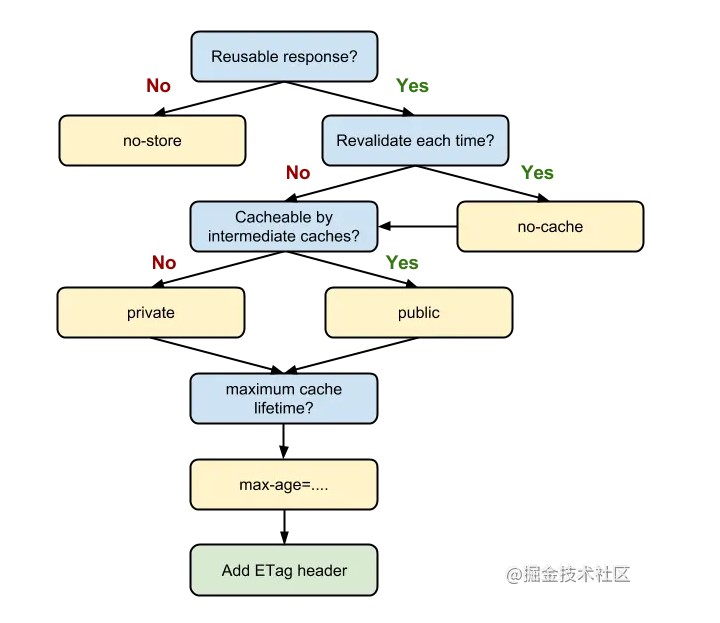

## 说一下 http 和 https

基本概念：http 又叫超文本传输协议，是互联网使用最广的一种网络协议；https 是 http 的安全版

http 的缺点是明文传输和缺少完整性校验，仅在报文头部包含了传输数据长度的校验，对内容是否被篡改不做校验，攻击者可以发动中间人攻击，修改传输数据

https 对此进行了改进 

第一：双向身份认证  
客户端发起 SSL 握手消息给服务端要求连接  
服务端发送证书给客户端  
客户端确认证书是否为自己信任的证书签发机构签发，若不是则给用户选择是否继续，若是则客户端认可服务端身份  
服务端要求客户端发送证书，并检查是否通过验证，若失败则断开连接，若成功则从证书中获取客户端的公钥，双方身份认证成功

第二：数据传输的机密性

第三：防止重放攻击  
在 SSL 中有一个唯一的随机数来标记握手，防止攻击者嗅探到登录的过程中的数据进行重传攻击

https 原理

1. 客户端向服务端发起连接
2. 服务端发送证书给客户端
3. 客户端确认证书为可信的第三方发布后，生成一个随机数，然后用证书公钥进行加密，传送给服务端
4. 服务端用证书私钥进行解密后获取随机数，然后用随机数对称加密内容后传输给客户端，至此双方都知道了随机数是什么
5. 客户端用随机数进行解密

## tcp 三次握手

客户端和服务端确认双方的发送和接收能力

1. c 发起连接，s 收到确认 c 的发送能力
2. s 发送，c 收到确认 s 的收发能力
3. c 再发送一次，s 收到确认 c 的接收能力

## TCP 和 UDP 的区别

TCP 保证数据的正确性，在传递数据之前会有三次握手来建立连接，在传递数据时有确认、窗口、重传等控制机制，在数据传完后会断开连接，缺点是占用系统资源，效率更低  
UDP 是无状态的传输协议，传递数据是很快，且不管丢包的情况  
使用场景：对速率要求搞和可靠性要求不高的可以使用 UDP，如长视频、语音等；对数据可靠性要求高的使用 TCP，如文件传输、邮箱、浏览器等

|            | TCP          | UDP          |
| ---------- | ------------ | ------------ |
| 是否连接   | 面向连接     | 面向非连接   |
| 传输可靠性 | 可靠         | 不可靠       |
| 应用场合   | 传输少量数据 | 传输大量数据 |
| 速度       | 慢           | 快           |

TCP 是面向字节流，他把应用层下来的数据看成无结构的字节流，发送方 TCP 会把数据放入缓存区，等可以发送的时候再发送，TCP 会根据当前网络的拥堵状况来确定每个报文段的大小  
UDP 是面向报文，应用层下来的数据在上面加上首部后交给网络层，也就是说无论应用层发多大的数据，统统一次发送，因此需要应用层控制报文的大小

## Websocket 的实现和应用

http 是无状态连接，服务端无法主动向客户端发送数据，传统的解决办法是轮询，websocket 可以建立一个固定连接，方便服务端主动向客户端发送数据，也就是说只要服务端想主动向客户端发送数据，就可以考虑使用 websocket 方案了

## Http 的 head 请求方式

head 请求类似 get 请求，只返回了响应头信息，可以检查超链接的有效性，可以被缓存，可以检查网页是否被修改，多用于自动搜索机器人获取网页的标志信息，获取 rss 种子信息，或者传递安全认证信息等

## 为什么发送 POST 请求会先发一个 Options 请求

浏览器发起一个 Options 预检请求，获知服务端是否允许该跨域请求

## Cookie、sessionStorage、localStorage 的区别

共同点：都保存在浏览器端，且是同源的

cookie: http 是无状态协议，cookie 可以携带 sessionId 来标识用户，始终在同源的 http 请求中携带，存储大小是 4k 左右
sessionStorage: 仅在当前浏览器窗口关闭前有效
localStorage: 在所有同源窗口中共享，cookie 也是

## web worker

浏览器在执行脚本时，页面是不可响应的。web worker 是运行在后台的 js，不会影响页面的性能，并且通过 postMessage 将结果传给主线程，这样就不会阻塞主线程

注意

1. 同源限制
2. DOM 限制，无法读取 DOM 对象，可以读取 navigator 和 location 对象
3. 通信限制，需要通过 postMessage 来通信
4. 脚本限制，不能执行 alert 方法
5. 文件限制，无法读取本地文件，只能通过网络读取文件

## iframe

iframe 会创建包含另一个文档的内联框架  
缺点  
会阻塞主页面的 onload 事件  
不利于 SEO  
性能偏低

## cookie 如何防止 xss 攻击

在 set-cookie 上设置 httponly 禁止 js 访问 cookie，设置 secure 让浏览器仅在请求为 https 时发送 cookie

## Restful

用 url 定位资源，用 http 描述操作

## ios 300ms 延迟原因及如何解决

ios 等待 300ms 确认是否为双击，如果是双击则缩放至初始状态  
用 FastClick 库，其原理是检测 touchEnd 事件后，立刻触发模拟 click 事件，并把浏览器 300ms 之后的事件给阻断掉

## 前端优化

降低请求量：合并资源，减少 http 请求，gzip 压缩，懒加载  
加快请求速度：CDN 分发，预解析 DNS
缓存：http 协议缓存

## 浏览器缓存

浏览器缓存分 Memory Cache，Service Worker Cache，HTTP Cache，Push Cache 四种

### HTTP Cache

强缓存的相关字段有 expires 和 cache-control，如果同时存在，cache-control 的优先级高于 expires

expires 是时间戳，若本地时间小于 expires 设定的时间戳，则去缓存中取这个资源，所以若服务端和客户端存在时差，会出现差错，cache-control 中的 max-age 则在请求资源的时候记录时间点，计算两个时间点都来自于客户端，更精准

例子：  
cache-control: max-age=xxxx，public  
客户端和代理服务器在 xxxx 秒的有效期内都可以缓存该资源

cache-control: max-age=xxxx，private  
只让客户端可以缓存该资源；代理服务器不缓存

cache-control: max-age=xxxx，immutable  
客户端在 xxx 秒的有效期内，如果有请求该资源的需求的话就直接读取缓存,statu code:200 ，即使用户做了刷新操作，也不向服务器发起 http 请求

cache-control: no-cache  
跳过设置强缓存，但是不妨碍设置协商缓存；一般如果你做了强缓存，只有在强缓存失效了才走协商缓存的，设置了 no-cache 就不会走强缓存了，每次请求都会询问服务端。

cache-control: no-store  
不缓存，这个会让客户端、服务器都不缓存，也就没有所谓的强缓存、协商缓存了

协商缓存  
浏览器需要向服务器去询问缓存的相关信息，进而判断是重新发起请求、下载完整的响应，还是从本地获取缓存的资源  
如果服务端提示缓存资源未改动，资源会被重定向到浏览器缓存，对应的状态码是 304

如果启用了协商缓存，首次请求的响应头会带上 Last-Modified，其值为时间戳，随后每次请求头都会带上 If-Modified-Since 字段，其值为上一次 Last-Modified 的值  
服务器接收到请求后对比两个时间戳，如果不一致，返回一个完整的响应内容，并更新 Last-Modified 值，否则返回 304  
如果编辑了文件但是内容没有发生变化，服务器仍然会通过最后的编辑时间，发起一次完整的响应。修改文件的速度过快，服务器感知不到文件改动，不会发起新的完整请求。  
Etag 是由服务器为每个资源生成的唯一的标识字符串，和 Last-Modified 类似  
首次请求的响应头会带上 Etag，下一次请求时则会在请求头里带上 if-None-Match 字段，其值为上一次的 Etag 值  
服务器接收到请求后对比两个唯一标识值，如果不一致，返回一个完整的响应内容，并更新 Etag 值，否则返回 304  
Etag 在感知文件变化上比 Last-Modified 更加准确，优先级也更高。当 Etag 和 Last-Modified 同时存在时，以 Etag 为准

当我们的资源不可复用的时候，直接设置 Cache-Control 为 no-store，拒绝缓存；
否则考虑是否每次向服务器进行缓存有效确认，如果需要，则设置 Cache-Control 为 no-cache；
否则考虑是否被代理服务器缓存，若是则为 public，若否则为 private；  
考虑资源的过期时间，设置对应的 max-age 和 s-maxage 值；  
最后配置协商缓存用到的 Etag、Last-Modified 等参数

### Memory Cache

内存中的缓存，是浏览器优先去尝试命中的缓存，生命周期在 tab 关闭后结束，一般只存储体积不大的资源文件，较大的被扔进磁盘缓存

## 在地址栏输入url，到页面呈现出来会发生什么

1. 查找缓存，查找顺序为浏览器缓存、系统缓存、路由器缓存，没有则查询DNS服务得到 IP 地址
2. 浏览器根据 IP 和端口号生成一个请求，附带请求方法、请求附带的数据，并将请求封装在一个 tcp 包中
3. tcp包经过传输层、网络层、数据链路层、物理层到达服务器，服务器解析请求做出响应，返回 html
4. 浏览器根据html构建dom树，如果遇到Js脚本，会停止构建，开始下载代码，会造成阻塞，构建完成后渲染树
5. 其它请求会查看是否过期，没有过期则使用本地缓存，过期则校验 Etag 和 Last-Modified，若一致则返回304

## get 和 post 的区别 

语义不同：get 从指定的资源请求数据，post 从指定的资源提交要被处理的数据  
一般get请求参数放在url上，post请求参数放body上  
get和post都是TCP连接，不过 get 产生一个tcp包，post 产生两个tcp包（firefox除外）  
get请求：浏览器会把 http header 和 data 一并发送出去；post请求：浏览器先发送header，浏览器响应100 continue，浏览器再发送 data，服务器响应200 ok  

