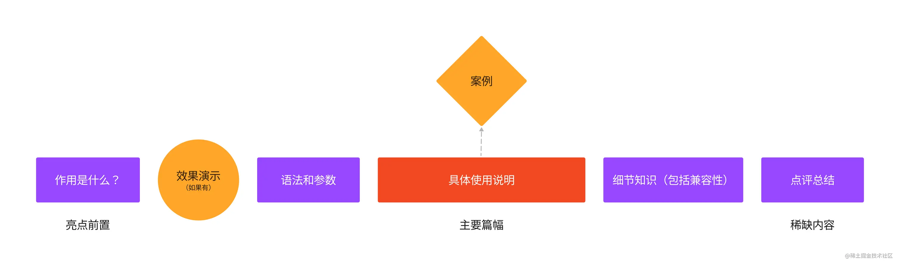
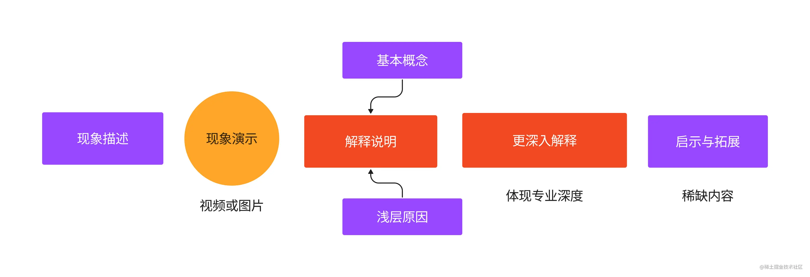
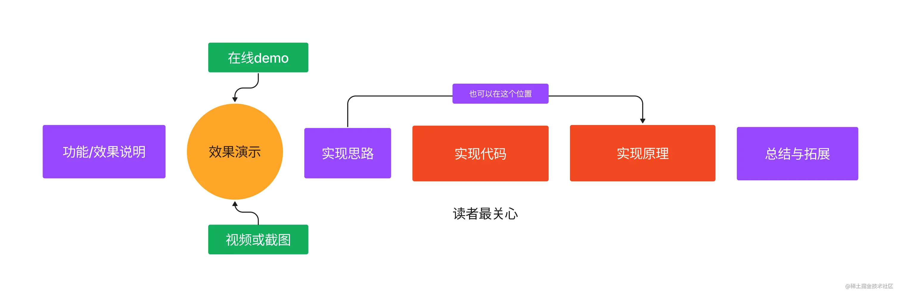
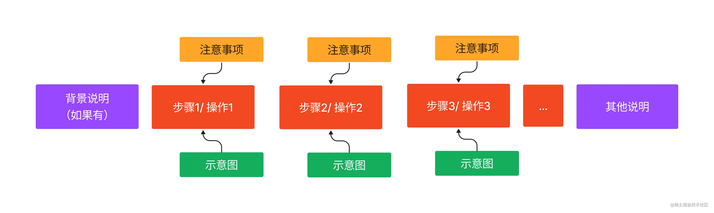
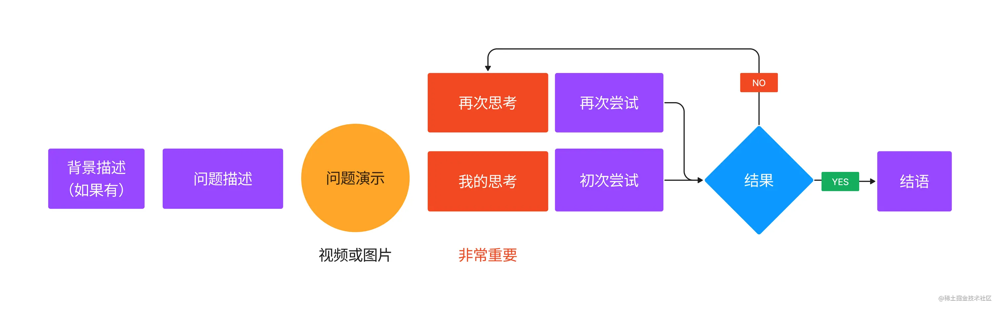
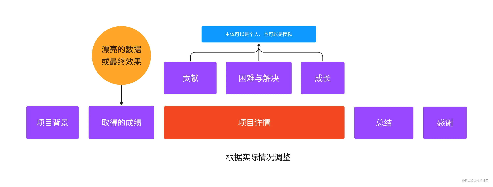
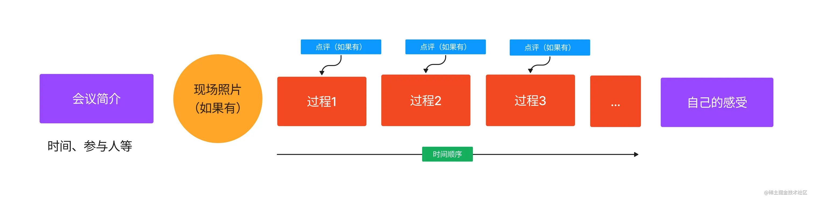
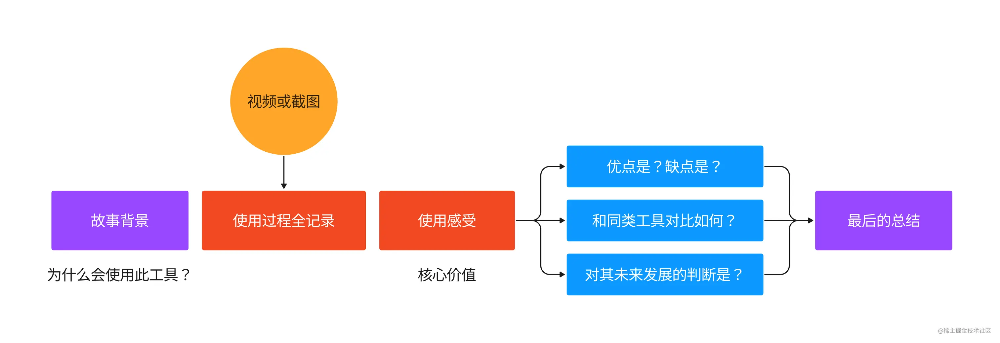
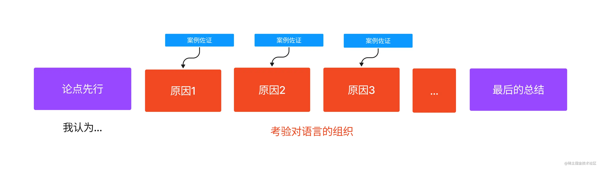

# 写作技巧

1. 确定方向
2. 素材收集、整理
3. 起标题
4. 文章框架结构
5. 逻辑化组织串联

选题类型
1. 日常工作的小技巧，小创新
2. 深入理解XXX，XXX原理剖析
3. 体现技术深度的棘手问题解决
4. 技术实现方案综述、技术类型对比

深入挖掘项目中遇到的问题
1. 分析背后的原因，避免再次遇到
2. 起因、思考、过程、问题、解决及结果完整闭环
3. 项目总结和反思

文章类型结构
1. 技术科普

2. 原理剖析

3. 功能实现

4. 使用教程

5. 问题解决

6. 项目总结

7. 会议记录

8. 工具测评

9. 技术人文

