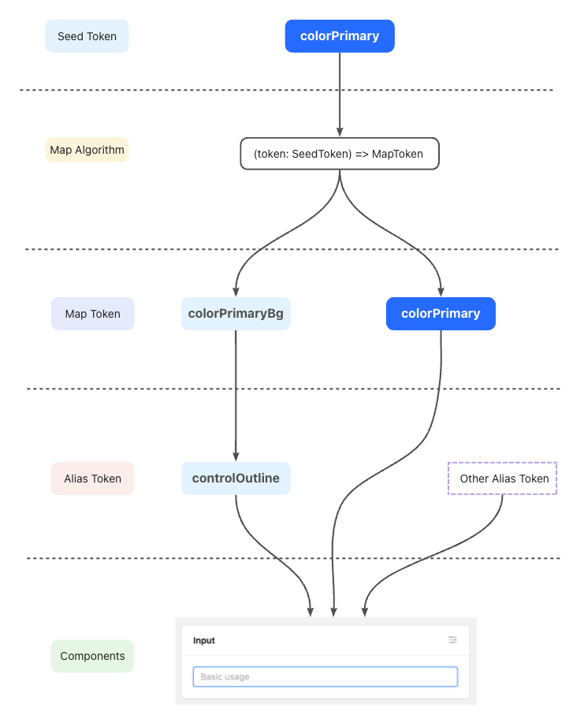

# antdv5 

名词解释

基础变量（Seed Token）。seed是种子的意思，seed token 意味着设计意图的起源

梯度变量（Map Token）。基于seed派生的梯度变量，比如 colorPrimaryBg（主题背景色）是 colorPrimary（主题色）的派生，推荐通过 theme.algorithm 实现

别名变量（Alias Token）。map token 的别名，用于批量控制某些共性组件的样式



基本算法（algorithm）。基本算法用于将 Seed Token 展开为 Map Token，比如由一个基本色算出一个梯度色板，或者由一个基本的圆角算出各种大小的圆角。算法可以单独使用，也可以任意地组合使用

``` ts
import { Button, theme } from 'antd';
import React from 'react';

const { useToken } = theme;

const App: React.FC = () => {
  // 使用 useToken 获取当前主题下的 Design Token
  const { token } = useToken();

  return <Button style={{ backgroundColor: token.colorPrimary }}>Button</Button>;
};

export default App;
```

``` ts
import { Button, ConfigProvider, theme } from 'antd';
import React from 'react';

const App: React.FC = () => (
  <ConfigProvider
    theme={{
      token: {
        // 在子主题中未被改变的 Design Token 将会继承父主题
        borderRadius: '4px',
        colorPrimary: '#1677ff',
      },
    }}
  >
    <Button />
    // 嵌套使用
    <ConfigProvider
      theme={{
        // 用于修改 Design Token
        token: {
          colorPrimary: '#1890ff',
        },
        // 继承上层 ConfigProvider 中配置的主题，默认为 true
        inherit: true,
        // 可以组合使用，设置可以自定义拓展算法
        algorithm: [darkAlgorithm, compactAlgorithm],
        // 用于修改各个组件的 Component Token 以及覆盖该组件消费的 Alias Token
        components: {
          Radio: {
            colorPrimary: '#00b96b',
          },
        },
      }}
    >
      <Button />
    </ConfigProvider>
  </ConfigProvider>
);

export default App;
```

seed token
``` js
const seedToken: SeedToken = {
  // preset color palettes
  ...defaultPresetColors,

  // Color
  colorPrimary: '#1677ff',
  colorSuccess: '#52c41a',
  colorWarning: '#faad14',
  colorError: '#ff4d4f',
  colorInfo: '#1677ff',
  colorTextBase: '',

  colorBgBase: '',

  // Font
  fontFamily: `-apple-system, BlinkMacSystemFont, 'Segoe UI', Roboto, 'Helvetica Neue', Arial,
'Noto Sans', sans-serif, 'Apple Color Emoji', 'Segoe UI Emoji', 'Segoe UI Symbol',
'Noto Color Emoji'`,
  fontFamilyCode: `'SFMono-Regular', Consolas, 'Liberation Mono', Menlo, Courier, monospace`,
  fontSize: 14,

  // Line
  lineWidth: 1,
  lineType: 'solid',

  // Motion
  motionUnit: 0.1,
  motionBase: 0,
  motionEaseOutCirc: 'cubic-bezier(0.08, 0.82, 0.17, 1)',
  motionEaseInOutCirc: 'cubic-bezier(0.78, 0.14, 0.15, 0.86)',
  motionEaseOut: 'cubic-bezier(0.215, 0.61, 0.355, 1)',
  motionEaseInOut: 'cubic-bezier(0.645, 0.045, 0.355, 1)',
  motionEaseOutBack: 'cubic-bezier(0.12, 0.4, 0.29, 1.46)',
  motionEaseInBack: 'cubic-bezier(0.71, -0.46, 0.88, 0.6)',
  motionEaseInQuint: 'cubic-bezier(0.755, 0.05, 0.855, 0.06)',
  motionEaseOutQuint: 'cubic-bezier(0.23, 1, 0.32, 1)',

  // Radius
  borderRadius: 6,

  // Size
  sizeUnit: 4,
  sizeStep: 4,
  sizePopupArrow: 16,

  // Control Base
  controlHeight: 32,

  // zIndex
  zIndexBase: 0,
  zIndexPopupBase: 1000,

  // Image
  opacityImage: 1,

  // Wireframe
  wireframe: false,
};
```

注意：ConfigProvider 对 message.xxx、Modal.xxx、notification.xxx 等静态方法不会生效，原因是在这些方法中，antd 会通过 ReactDOM.render 动态创建新的 React 实体。其 context 与当前代码所在 context 并不相同，因而无法获取 context 信息。当你需要 context 信息（例如 ConfigProvider 配置的内容）时，可以通过 Modal.useModal 方法会返回 modal 实体以及 contextHolder 节点。将其插入到你需要获取 context 位置即可，也可通过 App 包裹组件 简化 useModal 等方法需要手动植入 contextHolder 的问题。

``` ts
import { App } from 'antd';
import React from 'react';

const MyPage: React.FC = () => {
  // 注意：App.useApp 必须在 App 之下方可使用。
  const { message, notification, modal } = App.useApp();
  message.success('Good!');
  notification.info({ message: 'Good' });
  modal.warning({ title: 'Good' });
  // ....
  // other message, notification, modal static function
  return <div>Hello word</div>;
};

const MyApp: React.FC = () => (
  <App>
    <MyPage />
  </App>
);

export default MyApp;
```

兼容性调整，调整策略：每个大版本只会调整少量 API，并且原废弃 API 在新版本中会继续兼容，推迟到下下个大版本（预计v7废弃）移除

- 默认 Day.js 代替 Moment.js
- 弹层类组件 open 与 visible 统一至 open 以符合 HTML Spec
- dropdownClassName 与 popupClassName 统一至 popupClassName 以更符合语义
- 结构语法糖（例如 <Select.Option />）使用数据驱动代替，以为性能优化做准备
- 废弃静态方法（例如 Message.error），推荐应用层封装以支持 React 18 concurrent 模式

## 重点 cssinjs

缺点：cssinjs是运行时解析的方案，会有一定的性能开销，打包后的js体积也会增大

优化方案：
1. 应用级别的cssinjs很难找到合适的key去做hash缓存;antd的cssinjs方案是组件级别的缓存，通过缓存 组件名+token+version 来减少序列化css的次数，这样只有版本更新或者修改主题变量，才会去重新序列化css  
2. 应用级别的cssinjs存在props影响组件样式的可能，会在渲染阶段重新生成组件样式；antd组件的props不会影响组件样式，样式一并存在组件样式文件中，hash相同的情况下，同一组件只会在mount时生成一次样式

每一个组件都有 genComponentStyleHook 函数用来描述组件名、alias-token(对全局所有组件的混入修改)和component-token(对于组件的以及组件内部的混入修改)
useStyleRegister 创建一个style,有data-css-hash、data-token-hash、data-dev-cache-path(开发环境才有)三个属性，全局注册（缓存）样式，返回 wrapSSR，用来混入该 style对象
cssinjs下的 useGlobalCache函数和StyleContext用做全局缓存

总结：首先在组件内的useStyle传入了warpSSR和hashId，执行genComponentStyleHook，最终返回useStyleRegister这个函数并传入styleFn，核心执行useGlobalCache函数，styleFn执行时组件本身的样式和被合并的token就被加载到一个StyleObj对象上了。通过parseStyle函数传入的path、hashId、以及暴露在外的api最终解析出来的是一个被序列化的对象，最终cachedStyleStr, cachedTokenKey, cachedStyleId渲染到style标签上，这样可以让组件本身具备了更细粒度的包体积和性能

[v5.1开始自定义主题](https://ant.design/docs/react/customize-theme-cn#%E5%9C%A8-configprovider-%E4%B8%AD%E9%85%8D%E7%BD%AE%E4%B8%BB%E9%A2%98)